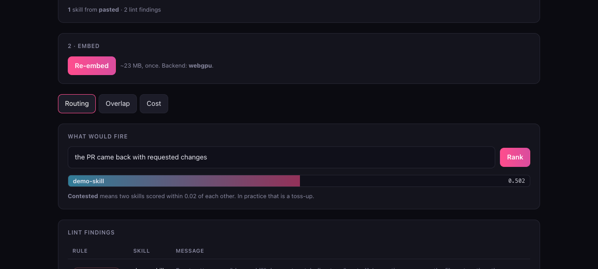

# skill-radar

Load a folder of agent skills, type what a user would actually say, and see which skills
would fire.



**Runs entirely in your browser.** No API key, no account, no server of mine. The model is
fetched once and cached, after which the page works offline. Nothing you load is uploaded
anywhere.

## The problem

A skill fails quietly. Two of them claim the same ground, and which one fires is a toss-up
you never see happen.

[`skill-lint`](https://github.com/rlawoals0529/skill-lint) catches the structural version:
an exactly shared quoted trigger phrase. It cannot catch the commoner one, because a string
comparison has no way to know that *"the PR came back"* and *"requested changes"* mean the
same thing.

This does. It embeds every description with a real model and compares them by meaning.

## Three views

**Routing.** Type an utterance, get every skill ranked. Two skills within 0.02 of each other
are marked **contested**, because in practice that is a coin flip.

**Overlap.** Every pair, ranked by semantic similarity. Run against a real ten-skill set,
the top pair shared **no quoted trigger at all** - the linter was structurally unable to
report it, and it was a genuine duplication.

**Cost.** Token counts from the model's own tokenizer for the description block, which is
paid for on every single turn. Most people estimate this. Nobody measures it.

## Getting skills in

- **Pick a folder** (Chromium's directory picker)
- **Drop or choose `.md` files** (every browser)
- **Load a public GitHub repo**, so the demo works with no local files
- **Paste one skill**, to try a single description

## What this is not

Cosine similarity over descriptions is **not** how any particular agent harness routes. This
is a proxy that surfaces overlap and cost, not a simulation of a specific router. Treat a
contested pair as a reason to go and read both descriptions, not as a verdict.

The token counts are this model's tokens, not your agent's. A good proxy, not the exact bill.

The `broken-reference` lint rule is **skipped** here, because there is no filesystem to check
a path against. A tool that cannot check something should say nothing about it rather than
assume the happy answer.

## Run it

```bash
npm install
npm run dev
```

## Tests

```bash
npm test              # the ranking maths, with fixed vectors and no model
npm run test:integration   # the real model against a real skills tree
```

The maths is a pure function of two vectors, so it is tested without ever loading a model:
identical, orthogonal and opposite directions, magnitude independence, a zero vector
returning `NaN` rather than a plausible-looking `0`, and a dimension mismatch throwing
instead of silently comparing the overlap.

The integration test is the one that matters, and it earned its place. It originally asserted
that a deliberately-colliding pair would rank **first**. It ranked second - and the tool was
right while the test was wrong, because a shared quoted phrase and semantic overlap are
different measures. That is now what the test asserts, and a second test pins the actual
value proposition: at least one strongly-similar pair shares no trigger phrase, so a linter
cannot see it.

## Built on

[`skill-lint/core`](https://github.com/rlawoals0529/skill-lint) parses the skills and runs
the structural rules. It is a dependency, not a copy - the parser exists once.

Model: `Xenova/all-MiniLM-L6-v2` via [Transformers.js](https://huggingface.co/docs/transformers.js),
WebGPU where available and the default backend otherwise.

MIT
